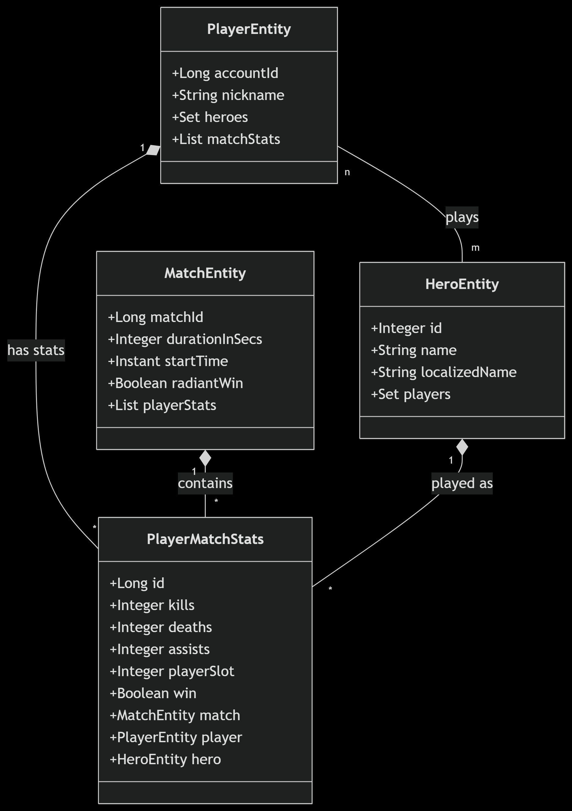
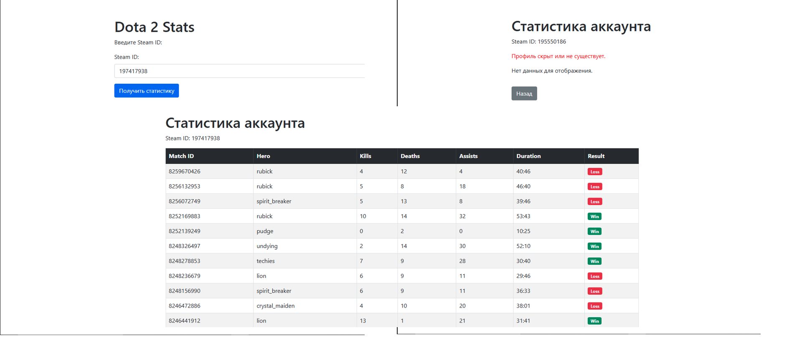

# Сайт для просмотра статистики аккаунта Dota 2

📌 **GIT репозиторий:** [https://github.com/THETOUCH/stats](https://github.com/THETOUCH/stats)

## 📋 Этапы реализации

### 🔹 Stage 2 — Capstone Project Use Cases

#### Функциональные требования:
- По ID аккаунта выводится вся статистика игрока по последним 25 матчам.

#### Нефункциональные требования:
- Совместимость с API Steam.

---

### 🔹 Stage 3 — Добавлена диаграмма

### 🔹 Stage 4 — Добавил скриншоты интерфейса

